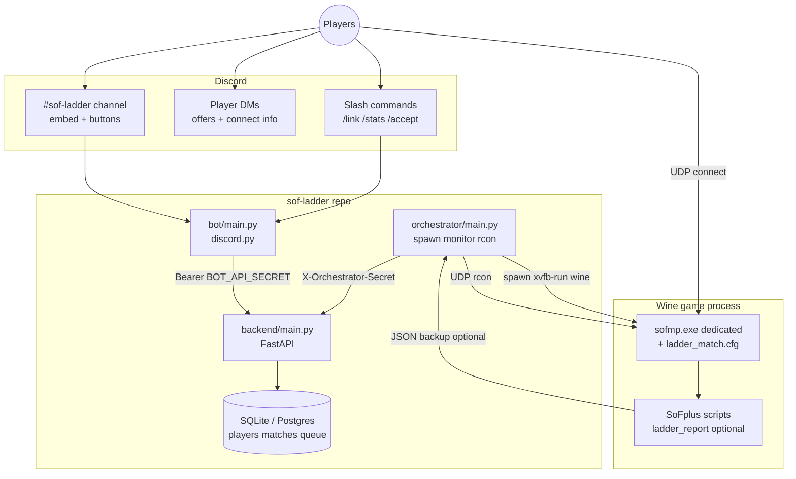
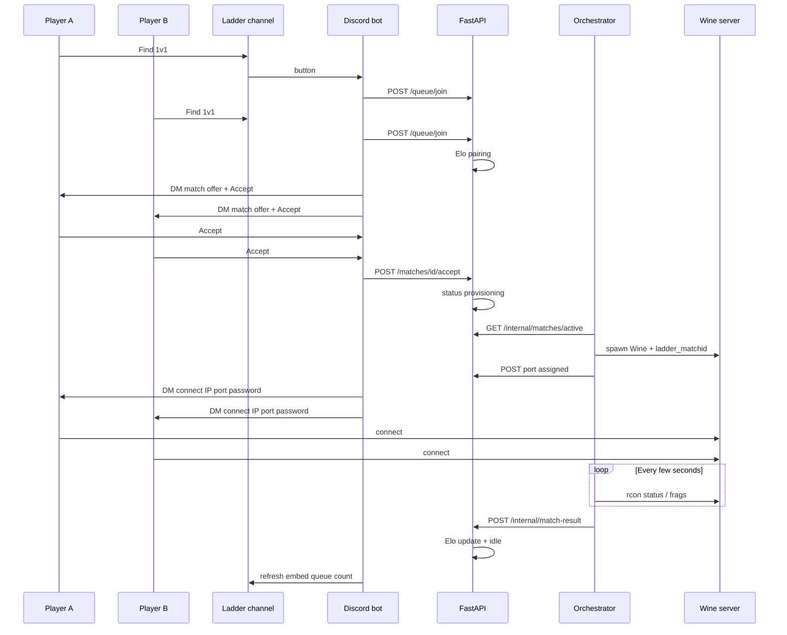
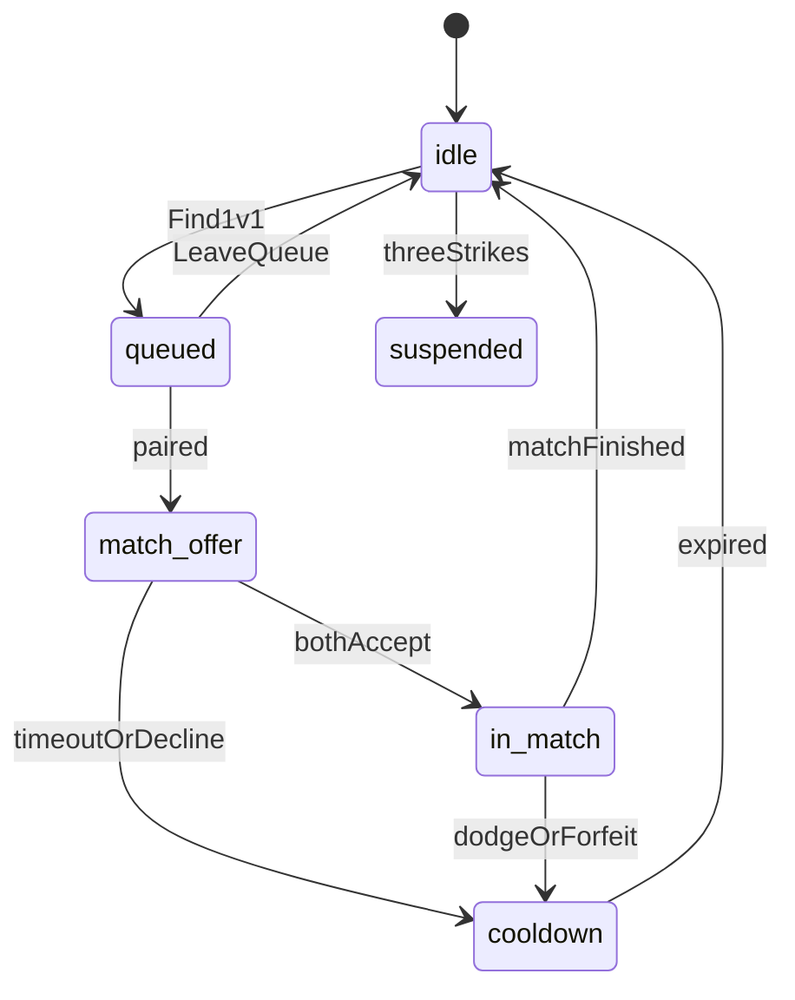

# SoF Ladder — 1v1 Discord Matchmaking

Discord-driven ranked 1v1 deathmatch ladder for Soldier of Fortune. Players queue in a dedicated channel, get paired by Elo, accept matches, and connect to dynamically spawned Wine dedicated servers.

## System architecture

High-level parts on a single VPS (API, bot, orchestrator, and game servers colocated):



### Match flow (1v1)

From queue to Elo update:



### Player states (API)



## Components

| Service | Module | Role |
|---------|--------|------|
| API | `backend/main.py` | Players, queue, Elo, matches |
| Bot | `bot/main.py` | Discord slash commands and ladder channel UI |
| Orchestrator | `orchestrator/main.py` | Spawn Wine servers, rcon monitoring, results |
| Game configs | `game/` | `ladder_match.cfg`, SoFplus `ladder_report` scripts |

## Quick start (dev)

```bash
cd sof-ladder
python3 -m venv venv
source venv/bin/activate
pip install -r requirements.txt
cp .env.example .env
# Edit .env: BOT_API_SECRET, ORCHESTRATOR_SECRET, DISCORD_* 

export PYTHONPATH=.
python -c "from ladder.db import init_db; init_db()"

# Terminal 1
uvicorn backend.main:app --reload --port 8080

# Terminal 2 (after Discord app + token)
python -m bot.main

# Terminal 3 (on VPS with SoF + Wine installed)
python -m orchestrator.main
```

## Discord setup

1. Create an application at https://discord.com/developers/applications
2. Add a bot and copy the token into `DISCORD_BOT_TOKEN`
3. **Invite the bot to your server** with scopes **`bot`** and **`applications.commands`** (required for slash commands). On startup the bot prints an invite URL, or use:
   `https://discord.com/oauth2/authorize?client_id=YOUR_APP_ID&permissions=2147486720&scope=bot%20applications.commands`
4. Set `DISCORD_GUILD_ID` to your server ID (Developer Mode → right-click server → Copy Server ID)
5. The bot must be a member of that guild before guild command sync works; otherwise it falls back to global sync

### Ladder channel embed (setup & sync)

The ladder UI is a **single persistent message** in one text channel — not a new post every time someone queues.

#### One-time channel setup

1. Create a dedicated text channel (e.g. `#sof-ladder`).
2. Enable **Developer Mode** in Discord → User Settings → Advanced → right-click the channel → **Copy Channel ID**.
3. Put that ID in `.env` as `DISCORD_LADDER_CHANNEL_ID`.
4. Ensure the bot role can **View Channel**, **Send Messages**, **Embed Links**, and **Read Message History** in that channel.
5. Start the API (`uvicorn backend.main:app`) and the bot (`python -m bot.main`). No manual message is required.

#### What the bot does on startup

When the bot connects (`on_ready` in `bot/main.py`):

1. Registers **persistent button handlers** (`LadderView` with fixed `custom_id`s) so **Find 1v1** / **Leave queue** / **Stats** keep working after a bot restart.
2. Syncs slash commands (guild or global — see above).
3. Calls `refresh_ladder_embed()` for `DISCORD_LADDER_CHANNEL_ID`.

#### How `refresh_ladder_embed` works

Implementation: `bot/main.py` → `refresh_ladder_embed()`.

| Step | Behavior |
|------|----------|
| Find existing panel | Reads the last **10** messages in the ladder channel. |
| Reuse if found | If one is from **this bot** and has an **embed**, that message is **edited** in place (same message ID, no spam). |
| Create if missing | If none found, the bot **sends** a new embed message. |

**Embed content** (updated on each refresh):

- Title: **SoF 1v1 Ladder**
- Description: reminder to `/link` first
- **In queue** — live count from `GET /queue/count` on the API
- **Map** — `dm/jpntclx` (v1 default)
- **Frag limit** — from `FRAGLIMIT` in `.env`

**Buttons** on the same message:

| Button | Action |
|--------|--------|
| **Find 1v1** | `POST /queue/join` — ephemeral reply to the clicker; refreshes the channel embed |
| **Leave queue** | `POST /queue/leave` — ephemeral reply; refreshes the embed |
| **Stats** | `GET /players/{discord_id}` — ephemeral only (does not edit the panel) |

The embed’s **In queue** count is refreshed when someone uses **Find 1v1**, **Leave queue**, or `/cancel`, and when the bot starts. It is not polled on a timer; two players queuing without touching the panel may leave the count slightly stale until the next refresh.

#### After setup you should see

- One red embed in `#sof-ladder` with three buttons.
- Clicking **Stats** without `/link` still works but shows `not linked`.
- Queueing requires `/link <in_game_name>` first (ephemeral errors come from the API).

#### Troubleshooting the panel

| Problem | Fix |
|---------|-----|
| No embed appears | Check `DISCORD_LADDER_CHANNEL_ID`, bot permissions, and that the API is running (queue count call fails silently if the channel is wrong). |
| Multiple embeds | Delete older bot messages in the channel; restart the bot — it will adopt the newest qualifying message in the last 10 or post a new one. |
| Buttons do nothing after restart | Restart the bot once so `on_ready` runs `bot.add_view(LadderView())` (persistent views). |
| Wrong queue count | Use **Leave queue** / **Find 1v1** or restart the bot to force `refresh_ladder_embed`. |

Match offers and connect info are **not** on this embed — they are sent by **DM** (and the background poll for pending/live matches). Players must allow DMs from server members or use `/accept <match_id>`.

### Commands

- `/link <in_game_name>` — required before queueing
- `/stats`, `/leaderboard`, `/cancel`, `/accept <match_id>`

Slash commands are separate from the channel embed; the embed is only for queueing and at-a-glance queue size.

## VPS / Wine server setup

1. Install: `wine`, `winetricks`, `xvfb`, Python 3.11+
2. Install SoF 1.07f + SoFplus into `WINEPREFIX` (default `/opt/sof/wineprefix`)
3. Copy game configs into the server user directory:
   - `game/ladder_match.cfg` → `$SOF_CWD/user/ladder_match.cfg`
   - `game/sofplus/*.cfg` → `$SOF_CWD/user/sofplus/sv/`
4. Open UDP ports `PORT_START`–`PORT_END` (default 28910–28959)
5. Set `SERVER_CONNECT_IP` to your public IP
6. Create `SOF_LADDER_OUT_DIR` for SoFplus result JSON backups

## systemd (production)

```bash
sudo cp -r . /opt/sof-ladder
sudo cp deploy/*.service /etc/systemd/system/
sudo systemctl enable --now sof-ladder-api sof-ladder-bot sof-ladder-orchestrator
```

## Elo & anti-abuse

- Standard Elo with variable K by games played (see `ladder/elo.py`)
- Queue spam, accept timeout, dodge, forfeit, and strikes (see `ladder/penalties.py`)

## API secrets

- Bot uses `Authorization: Bearer $BOT_API_SECRET`
- Orchestrator uses header `X-Orchestrator-Secret: $ORCHESTRATOR_SECRET`
