# SoF Ladder — 1v1 Ranked Matchmaking

Ranked **1v1** matchmaking for **Soldier of Fortune**: one ladder account per player, Elo pairing, and a **fresh dedicated server** for each match.

## What it does

| Step | What happens |
|------|----------------|
| **1. Link** | One-time signup via Discord `/link` + verify server — see [Player registration & identity](#player-registration--identity). |
| **2. Queue** | Verified players enter one shared queue (Elo window widens the longer you wait). |
| **3. Accept** | When paired, **both** must accept (Discord DM / `/accept` or `.ladder accept`). |
| **4. Play** | Orchestrator spawns a **new** `sofmp.exe` on `PORT_START`…`PORT_END`; you connect to that host — not the server you queued from. |
| **5. Result** | SoFplus writes match files under `ladder_out/`; the API updates Elo and applies cooldowns / strikes. |

You can use **Discord**, **in-game**, or **mix them** after you are verified. **Registration is Discord-only**; every later session is recognized by `_sp_cl_info_ladder_uid` on your game client ([persistence rules](#keeping-your-identity-across-sessions)).

## Two ways to play

| | Discord | In-game |
|---|---------|---------|
| **Setup** | [`/link` + verify](#how-to-register-first-time-players) (once) | — (must [register on Discord](#player-registration--identity) first) |
| **Queue** | Embed **Find 1v1** / **Leave queue**, `/cancel` | `.ladder join` / `.ladder leave` |
| **Accept** | DM button or `/accept <id>` | `.ladder accept` |
| **Connect** | DM with `IP:port` + password | `.ladder status` |

In-game commands run on **any server** with [`ladder_report.cfg`](game/sofplus/addons/ladder_report.cfg) loaded — verify server, active **match** servers, or optional **hub** (`LADDER_HUB_ENABLED=1`, port `LADDER_HUB_PORT`). Commands write `ladder_out/cmd/*.cfg`; the orchestrator maps `ladder_uid` → the same API logic the bot uses.

**On a live match server:** the two fighters (`in_match`) cannot `.ladder join` on that server; **spectators** (up to `MATCH_MAX_CLIENTS`, default 8) can queue for the next game.

## Four programs

| Program | Code | Job |
|---------|------|-----|
| **API** | `backend/main.py` | Players, queue, matches, Elo, SQLite DB |
| **Bot** | `bot/main.py` | Discord slash commands, `#sof-ladder` embed, DMs |
| **Orchestrator** | `orchestrator/main.py` | Spawn/monitor Wine servers; read `ladder_out/` |
| **Game servers** | `wine … sofmp.exe` | UDP gameplay (verify + one process per match) |

**v1 (recommended):** run all four on **one game VPS**. The bot may run elsewhere; the orchestrator **must** stay on the machine that runs Wine/SoF. See [Deployment topology](#deployment-topology).

## Player registration & identity

There is **no web signup form**. You **register once** by linking a **Discord account** to a **game client**, then reuse the same client id on every PC session. In-game nicknames and Discord display names are **never** used as account ids.

### How to register (first-time players)

Registration = **`/link` on Discord** + **one visit to the verify server** with two client cvars set.

| Step | What you must do |
|------|------------------|
| **1** | In Discord, run **`/link`** (bot replies with an ephemeral embed). |
| **2** | Copy the two **`+set`** lines from **Launch cvars** into your SoF shortcut or `autoexec.cfg` (before you start the game). |
| **3** | Launch SoF **with those cvars active** (they must be in the process that connects). |
| **4** | Connect to **`SERVER_CONNECT_IP:VERIFY_SERVER_PORT`** (default port **28908**) within **15 minutes** of `/link`. |
| **5** | Stay on the verify server briefly; SoFplus reads your cvars via `sp_sv_client_check`. |
| **6** | Run **`/stats`** in Discord — you should see a linked in-game name and your `ladder_uid`. You can then queue. |

**Server-assigned secrets (do not invent your own values):**

| Name | Client cvar | Lifetime |
|------|-------------|----------|
| Account id (`ladder_uid`, UUID v4) | `_sp_cl_info_ladder_uid` | **Permanent** — keep in shortcut forever |
| One-time verify token (32 hex chars) | `_sp_cl_info_ladder_verify` | **Link only** — remove from shortcut after verify |

Example lines from `/link` (use your values, not these):

```text
+set _sp_cl_info_ladder_uid "0875472d-7c4e-4fee-acf2-519308e1d441" +set _sp_cl_info_ladder_verify "a4319f98dab49dce35dfc87bb644d835"
```

**Cannot register in-game.** `.ladder join` before verify returns *not linked*. You need an existing row created by `/link`.

**Cannot register without Discord.** The ladder row is keyed by your Discord user id; the bot is the only signup UI.

### Verified vs unverified

| Status | Database | Can queue / play ranked? |
|--------|----------|-------------------------|
| **Unverified** | `ladder_uid` set, `verify_nonce` still set | **No** |
| **Verified** | `ladder_uid` set, `verify_nonce` cleared (`NULL`) | **Yes** |

Queue checks ([`is_verified`](ladder/identity.py)): uid present **and** verify nonce cleared.

### Keeping your identity across sessions

Your account is **`discord_id` + `ladder_uid`**. Elo, strikes, and queue state live in the **ladder database** on the VPS. The **game only knows you** if your shortcut still sets the same `_sp_cl_info_ladder_uid`.

**What you must keep unchanged**

| Item | Why |
|------|-----|
| Same **Discord account** for `/link`, `/stats`, embed buttons | Bot identifies you by Discord user id. |
| Same **`_sp_cl_info_ladder_uid` value** in every launch | In-game `.ladder` and match presence use this uuid, not your nickname. |

**After verify, your shortcut should contain only the uid line:**

```text
+set _sp_cl_info_ladder_uid "<your-uuid>"
```

Remove `_sp_cl_info_ladder_verify` after a successful verify — it is only for the initial proof.

**Where identity is stored**

| Location | What | Survives game PC reboot? |
|----------|------|-------------------------|
| **Ladder DB** | `players.ladder_uid` tied to your Discord | **Yes** — until you run `/link` again |
| **Your PC** | `+set _sp_cl_info_ladder_uid "…"` in shortcut / `autoexec.cfg` | **Only if you saved it** — SoF does not remember it for you |

Save the uid the same way you persist any other launch option: shortcut target, `autoexec.cfg`, or a wrapper script you always use to start SoF.

**Recovering a lost shortcut (already verified)**

1. **`/stats`** or the channel **Stats** button → copy the `ladder_uid` shown.
2. Put it back in your shortcut as `+set _sp_cl_info_ladder_uid "…"`.
3. **Do not** run `/link` only to “get the uuid back” — `/link` **rotates** your uid and invalidates the old shortcut until you verify again.

**When `/link` is appropriate**

| Situation | What to do |
|-----------|------------|
| First signup or verify never completed | `/link` → verify server within 15 min |
| Lost uid on PC, still verified on ladder | `/stats` → copy uid (no `/link`) |
| New gaming PC / reinstall | Copy the **same** uid into the new shortcut (from `/stats` if needed) |
| Intentional re-bind | `/link` only while **idle** (not queued, not in `match_offer`, not `in_match`) |
| Verify window expired | `/link` again for a fresh nonce |

**What breaks identity**

| Action | Effect |
|--------|--------|
| Run `/link` while queued or in a match | **Rejected** — leave queue or finish the match first |
| Run `/link` again while idle | **New** `ladder_uid` — old shortcut stops working until you re-verify |
| Change `_sp_cl_info_ladder_uid` to another value | Treated as a different or unlinked client |
| Use a second Discord account | **Second ladder account** (separate Elo row) |

Technical reference (cvar checks, export files, diagrams): [Player identity (reference)](#player-identity-reference).

### Match data (orchestrator)

- **Results:** `ladder_match.func` + `ladder_check.func` → `ladder_out/<match_id>/` (presence, snapshots, `result.cfg`).
- **Abuse:** queue spam cooldowns, accept timeout, dodge penalties, three-strike suspension.

---

## System architecture

Component diagram (v1: all boxes on one game VPS unless you split the bot — see [Deployment topology](#deployment-topology)).

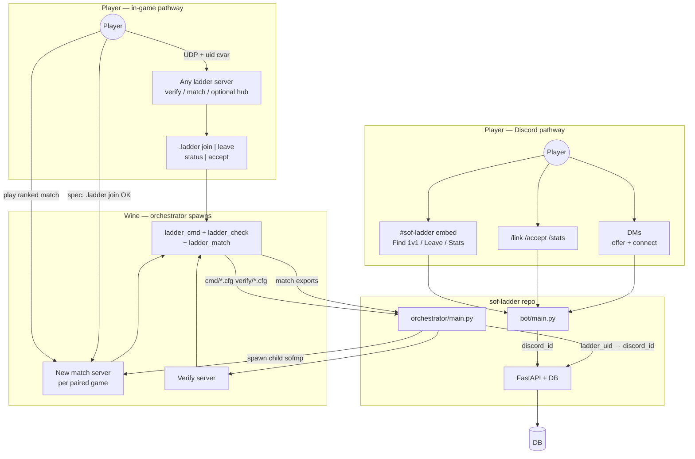

## Discord vs in-game pathways

Same queue and API for both UIs — pick either control per step, or mix them (e.g. queue in-game, accept via Discord DM). Step-by-step table:

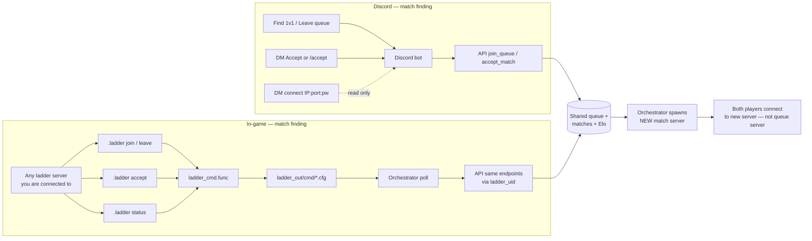

| Step | Discord | In-game | Notes |
|------|---------|---------|--------|
| **Account setup** | [`/link` → verify server](#how-to-register-first-time-players) | — | **Discord only** — see [registration](#player-registration--identity) |
| **Queue** | **Find 1v1** button or `/cancel` to leave | `.ladder join` / `.ladder leave` on **any ladder server** | Same queue; **not** while `in_match` (players in the active 1v1); **spectators OK** |
| **Status** | `/stats` or embed **Stats** | `.ladder status` | Same player row; in-game shows connect `IP:port` when ready |
| **Accept offer** | DM **Accept** or `/accept <id>` | `.ladder accept` | Same match; both must accept before server spawns |
| **Connect to match** | DM with password | `.ladder status` after accept | Same `SERVER_CONNECT_IP` + assigned port |
| **Play / Elo** | — | — | Orchestrator only; no player UI |

**One account, both UIs:** [Unique players, mixed Discord + in-game](#unique-players-mixed-discord--in-game).

| Path | Flow |
|------|------|
| **Discord** | `bot/main.py` → HTTP with your `discord_id` |
| **In-game** | [`ladder_cmd.func`](game/sofplus/addons/ladder_cmd.func) → `ladder_out/cmd/<id>.cfg` → [`poll_game_commands`](orchestrator/game_cmd.py) → `ladder_uid` → same API |

Each accepted match gets its own child `sofmp.exe` (`+set ladder_matchid`, `ladder_match_uid_a/b` on the server). A permanent queue lobby is optional: `LADDER_HUB_ENABLED=1` on `LADDER_HUB_PORT` (default `28907`).

**Who can queue from a live match server**

| Client on match server | `.ladder join` |
|----------------------|----------------|
| The two ranked players (`in_match` in DB) | Blocked — finish the map first |
| Spectators / idle slots (`idle` or already `queued`) | Allowed — queue for the **next** match |
| Unverified | Blocked — `/link` first |

### Player link flow (`/link`)

Signup checklist: [How to register](#how-to-register-first-time-players). Persistence: [Keeping your identity across sessions](#keeping-your-identity-across-sessions).

Verification is **required before queueing**. Identity uses SoFplus [`sp_sv_client_check`](https://sof1.megalag.org/sofplus/download/sofplus-manual.html) — not rcon `dumpuser` or userinfo.

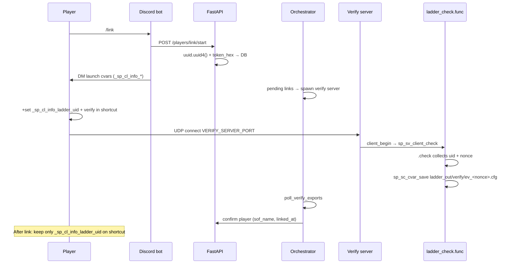

### Match finding — Discord pathway

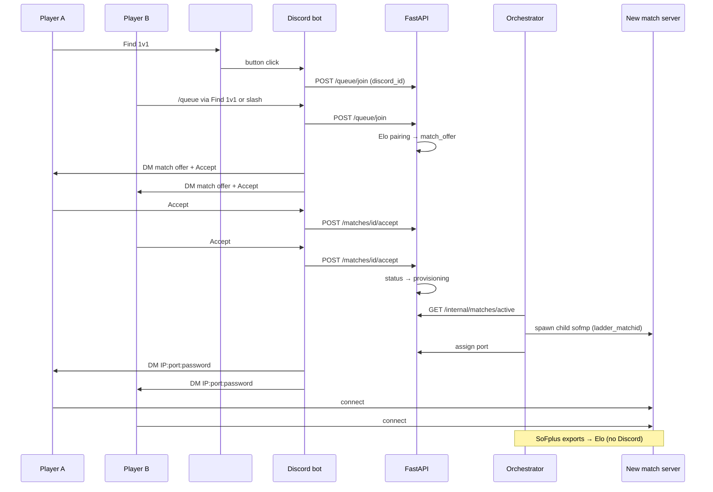

### Match finding — in-game pathway

Queue/accept from **any** server running `ladder_report.cfg` (spectator on a live match server is OK; the two fighters in that match are blocked). The server you queue from is **not** the ranked match server.

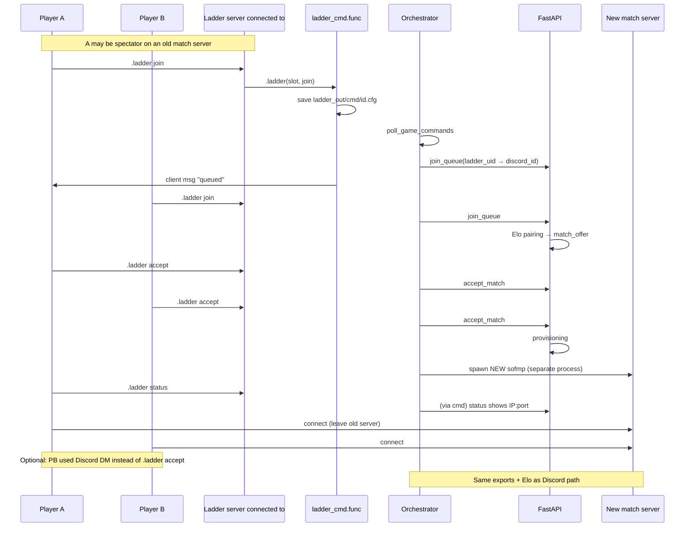

### After both connect (shared)

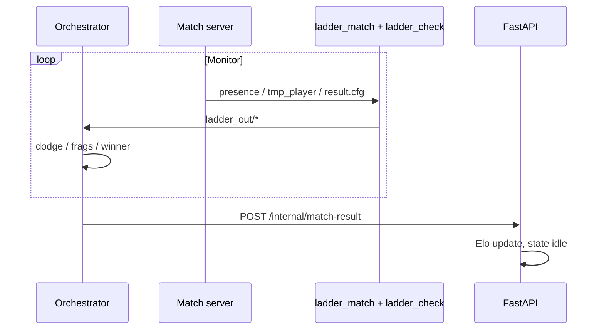

### Player states (API)

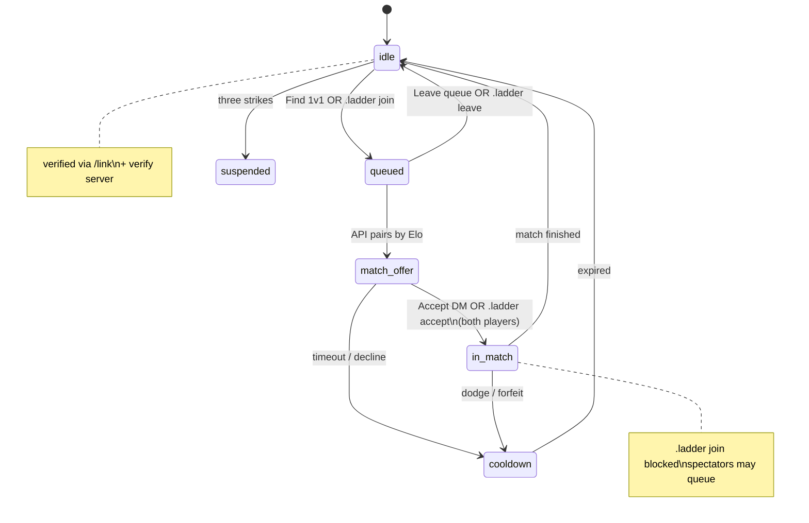

## Components

| Service | Module | Role |
|---------|--------|------|
| API | `backend/main.py` | Players, queue, Elo, matches |
| Bot | `bot/main.py` | Discord slash commands and ladder channel UI |
| Orchestrator | `orchestrator/main.py` | Spawn Wine servers; **read SoFplus export files** under `ladder_out/` |
| Game configs | `game/` | `ladder_match.cfg`, `sofplus/addons/*.func` |

## Deployment topology

Where each process must run, and what can be remote.

### What each process is (four separate programs)

These are **not** one monolith — you start up to **four Python processes** (plus Wine game servers when matches run):

| What you run | Code | What it does |
|--------------|------|----------------|
| **API server** | `uvicorn backend.main:app` → [`backend/main.py`](backend/main.py) | HTTP REST API: players, Elo, queue, matches, DB reads/writes. **No Discord, no Wine.** |
| **Discord bot** | `python -m bot.main` → [`bot/main.py`](bot/main.py) | Long-lived **discord.py** client: slash commands (`/link`, `/stats`), ladder channel **embed + buttons**, DMs for match accept/connect. Calls the API over HTTP — it does **not** implement ladder rules itself. |
| **Orchestrator** | `python -m orchestrator.main` → [`orchestrator/main.py`](orchestrator/main.py) | Polls API, **spawns/kills** `wine sofmp.exe`, watches **`user/sofplus/data/ladder_out/<match_id>/`** written by SoFplus ([`sp_sc_cvar_save`](https://sof1.megalag.org/sofplus/download/sofplus-manual.html)). Uses **rcon only as fallback**. **No Discord.** |
| **SoF dedicated server** | `wine … sofmp.exe` (child of orchestrator) | Actual game sim players connect to over **UDP**. Not Python; one process per active match. |

The row people confuse is the **Discord bot** (`bot/main.py`): it is only the Discord-facing UI layer. Players never “connect to the bot” for gameplay — they talk to Discord; the bot talks to your API; the API talks to the DB; the orchestrator runs the game.

### Co-location rules

| Component | Must co-locate with | Can run on another machine? | Why |
|-----------|---------------------|-----------------------------|-----|
| **Wine SoF dedicated server** (`sofmp.exe`) | **Orchestrator** | **No** | Spawned locally; SoFplus writes `ladder_out/<match_id>/*.cfg` beside the server; orchestrator reads those paths (rcon optional fallback). |
| **Orchestrator** (`orchestrator/main.py`) | **SoF server processes** | **No** (v1) | Reads `SOF_INSTALL_DIR` (and overrides) from `.env`; spawns `SOF_EXE` under that tree. |
| **API + database** (`backend/main.py` + DB file/Postgres) | Each other | Orchestrator/bot can point at a **remote** `API_BASE` | Default SQLite file must sit beside the API process; use Postgres if API is remote. |
| **Discord bot** (`python -m bot.main`) | **Nothing** (no hard coupling) | **Yes** | Needs only: outbound HTTPS to `API_BASE` (your FastAPI URL) and outbound access to **Discord’s servers**. Does not need Wine, SoF assets, open game ports, or rcon. Typical split: bot on a small always-on box, API + orchestrator + game on the VPS. |

**Discord bot detail** — if you run `python -m bot.main` on your laptop and `API_BASE=http://your-vps:8080` on the VPS:

- Slash commands and the `#sof-ladder` embed work as long as the API is reachable and `DISCORD_BOT_TOKEN` / channel IDs are set.
- Matchmaking, Elo, and match state still live on the VPS API/DB.
- Game servers still spawn only on the machine running **orchestrator**; connect DMs use `SERVER_CONNECT_IP` from `.env` (the game host’s public IP), not the bot’s IP.

### Recommended (v1): single game VPS

All four processes on the machine that runs Wine/SoF. This matches the systemd units in `deploy/` and the diagrams above.

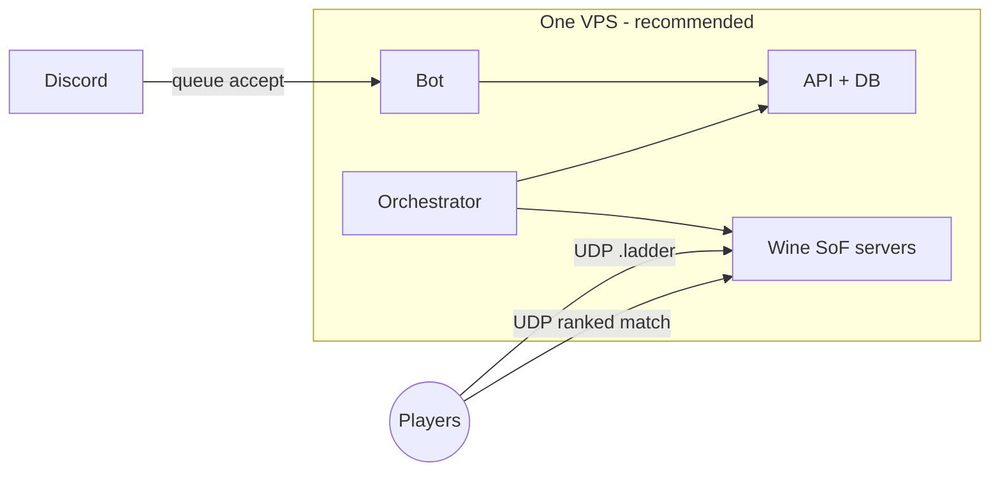

Set `SERVER_CONNECT_IP` to this VPS **public IP** so connect DMs point players at the right host.

### Optional split layout

Only split if you accept extra setup (Postgres, firewall rules, TLS on API).

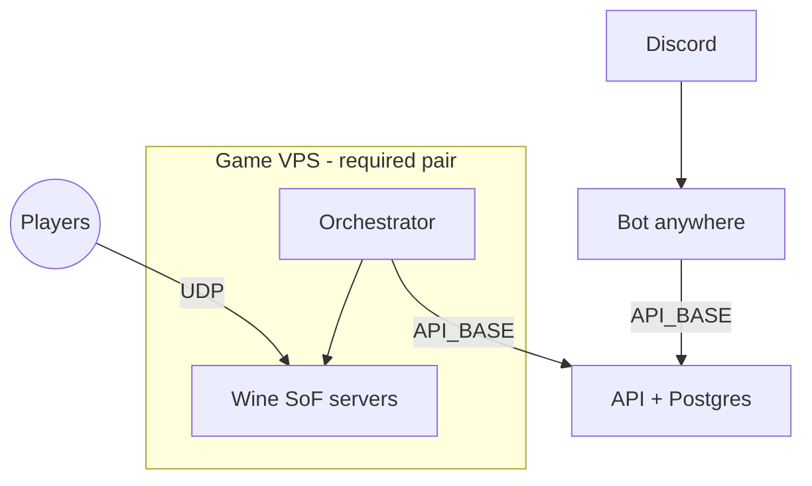

| Host | Run here | `.env` notes |
|------|----------|----------------|
| **Game VPS** | `orchestrator` + Wine/SoF | `API_BASE=https://your-api.example` (reachable URL), `SERVER_CONNECT_IP=<game VPS public IP>`, local `SOF_*` / `WINE*` paths |
| **App host** | `backend` (API) + DB | `DATABASE_URL=postgres://...`, bind `0.0.0.0` or reverse proxy; open port to bot + orchestrator only |
| **Any** (laptop, RPi, second VPS) | `python -m bot.main` | `API_BASE` → app host URL; `DISCORD_BOT_TOKEN`, `DISCORD_GUILD_ID`, `DISCORD_LADDER_CHANNEL_ID`; same `BOT_API_SECRET` as API expects |

**Do not** run the orchestrator on a different machine than the SoF servers without code changes (remote spawn/rcon are not implemented).

**Bot (`bot/main.py`) and API (`backend/main.py`)** on separate machines is fine: set the bot’s `API_BASE` to the API’s URL and use the same `BOT_API_SECRET` in both `.env` files. The bot never touches the database directly.

### Quick reference

```
┌─────────────────────────────────────────────────────────┐
│  SAME MACHINE (required)                                 │
│    orchestrator/main.py  ←→  wine sofmp.exe (match + verify) │
│    ladder_out/ — verify/, presence/, <match_id>/            │
└─────────────────────────────────────────────────────────┘

┌─────────────────────────────────────────────────────────┐
│  SAME MACHINE (recommended v1)                           │
│    backend/main.py  ←→  sqlite file or postgres          │
└─────────────────────────────────────────────────────────┘

┌─────────────────────────────────────────────────────────┐
│  ANY HOST with internet (optional split)                 │
│    python -m bot.main  ──HTTPS──►  API_BASE              │
│    (discord.py ↔ Discord; no game/Wine/rcon)             │
└─────────────────────────────────────────────────────────┘
```

## Quick start (dev)

```bash
cd sof-ladder
python3 -m venv venv
./venv/bin/pip install -r requirements.txt
cp .env.example .env
# Edit .env: BOT_API_SECRET, ORCHESTRATOR_SECRET, DISCORD_*, SOF_INSTALL_DIR, ...

chmod +x scripts/*.sh scripts/lib/common.sh
./scripts/run-all.sh          # API → bot → orchestrator (background)
./scripts/status.sh           # PIDs + API health + SoF paths
./scripts/stop-all.sh         # stop everything
```

Logs live under `.run/logs/` (`api.log`, `bot.log`, `orchestrator.log`).

**Foreground** (separate terminals, API with reload):

```bash
./scripts/run-api.sh --fg
./scripts/run-bot.sh --fg
./scripts/run-orchestrator.sh --fg
```

| Script | Role |
|--------|------|
| [`scripts/run-all.sh`](scripts/run-all.sh) | Start all services in order |
| [`scripts/stop-all.sh`](scripts/stop-all.sh) | Stop by PID files |
| [`scripts/status.sh`](scripts/status.sh) | PIDs, `/health`, `ladder.sof_paths` |
| [`scripts/run-api.sh`](scripts/run-api.sh) | API only |
| [`scripts/run-bot.sh`](scripts/run-bot.sh) | Discord bot only |
| [`scripts/run-orchestrator.sh`](scripts/run-orchestrator.sh) | Game orchestrator only |
| [`scripts/install-game-configs.sh`](scripts/install-game-configs.sh) | Copy cfg/func into SoF user dir |

## Discord setup

1. Create an application at https://discord.com/developers/applications
2. Add a bot and copy the token into `DISCORD_BOT_TOKEN`
3. **Invite the bot to your server** with scopes **`bot`** and **`applications.commands`** (required for slash commands). On startup the bot prints an invite URL, or use:
   `https://discord.com/oauth2/authorize?client_id=YOUR_APP_ID&permissions=2147486720&scope=bot%20applications.commands`
4. Set `DISCORD_GUILD_ID` to your server ID (Developer Mode → right-click server → Copy Server ID)
5. The bot must be a member of that guild before guild command sync works; otherwise it falls back to global sync

### Ladder channel embed (setup & sync)

The ladder UI is a **single persistent message** in one text channel — not a new post every time someone queues.

#### One-time channel setup

1. Create a dedicated text channel (e.g. `#sof-ladder`).
2. Enable **Developer Mode** in Discord → User Settings → Advanced → right-click the channel → **Copy Channel ID**.
3. Put that ID in `.env` as `DISCORD_LADDER_CHANNEL_ID`.
4. Ensure the bot role can **View Channel**, **Send Messages**, **Embed Links**, and **Read Message History** in that channel.
5. Start the API (`uvicorn backend.main:app`) and the bot (`python -m bot.main`). No manual message is required.

#### What the bot does on startup

When the bot connects (`on_ready` in `bot/main.py`):

1. Registers **persistent button handlers** (`LadderView` with fixed `custom_id`s) so **Find 1v1** / **Leave queue** / **Stats** keep working after a bot restart.
2. Syncs slash commands (guild or global — see above).
3. Calls `refresh_ladder_embed()` for `DISCORD_LADDER_CHANNEL_ID`.

#### How `refresh_ladder_embed` works

Implementation: `bot/main.py` → `refresh_ladder_embed()`.

| Step | Behavior |
|------|----------|
| Find existing panel | Reads the last **10** messages in the ladder channel. |
| Reuse if found | If one is from **this bot** and has an **embed**, that message is **edited** in place (same message ID, no spam). |
| Create if missing | If none found, the bot **sends** a new embed message. |

**Embed content** (updated on each refresh):

- Title: **SoF 1v1 Ladder**
- Description: reminder to [register via `/link`](#player-registration--identity) first; in-game `.ladder join` on any ladder server
- **In queue** — live count from `GET /queue/count` on the API
- **Map** — `dm/jpntclx` (v1 default)
- **Frag limit** — from `FRAGLIMIT` in `.env`

**Buttons** on the same message:

| Button | Action |
|--------|--------|
| **Find 1v1** | `POST /queue/join` — ephemeral reply to the clicker; refreshes the channel embed |
| **Leave queue** | `POST /queue/leave` — ephemeral reply; refreshes the embed |
| **Stats** | `GET /players/{discord_id}` — ephemeral only (does not edit the panel) |

The embed’s **In queue** count is refreshed when someone uses **Find 1v1**, **Leave queue**, or `/cancel`, and when the bot starts. It is not polled on a timer; two players queuing without touching the panel may leave the count slightly stale until the next refresh.

#### After setup you should see

- One red embed in `#sof-ladder` with three buttons.
- Clicking **Stats** without `/link` still works but shows `not linked`.
- Queueing requires **`/link`** and verify-server confirmation first (ephemeral errors come from the API).

#### Troubleshooting the panel

| Problem | Fix |
|---------|-----|
| No embed appears | Check `DISCORD_LADDER_CHANNEL_ID`, bot permissions, and that the API is running (queue count call fails silently if the channel is wrong). |
| Multiple embeds | Delete older bot messages in the channel; restart the bot — it will adopt the newest qualifying message in the last 10 or post a new one. |
| Buttons do nothing after restart | Restart the bot once so `on_ready` runs `bot.add_view(LadderView())` (persistent views). |
| Wrong queue count | Use **Leave queue** / **Find 1v1** or restart the bot to force `refresh_ladder_embed`. |

Match offers and connect info are **not** on this embed — they are sent by **DM** unless you use in-game `.ladder accept` and `.ladder status` instead ([pathways](#discord-vs-in-game-pathways)).

## Player identity (reference)

Player-facing rules: [Player registration & identity](#player-registration--identity).

Discord display names and in-game nicknames are **not** trusted. The API assigns **`ladder_uid`** (`uuid.uuid4()`) on `/link`; you copy it to **`_sp_cl_info_ladder_uid`**. SoFplus **`sp_sv_client_check`** proves your client holds that value ([SoFplus manual](https://sof1.megalag.org/sofplus/download/sofplus-manual.html), [`info_client.func`](https://github.com/VirtualFj8/sof-discord-bot/blob/main/sofplus/addons/info_client.func) pattern).

### Unique players, mixed Discord + in-game

There is **one ladder account per human**, not one per UI. The database row is keyed by **`discord_id`** (unique); **`ladder_uid`** (unique UUID) is the cross-game handle read from `_sp_cl_info_ladder_uid`. Matchmaking, queue state, and Elo all use that single row.

**You are not locked to the UI you used first.** Discord and in-game are two ways to call the same API for the same player. Example: queue with **Find 1v1**, accept with **`.ladder accept`**, read connect info from a **DM** or **`.ladder status`** — all valid on one account.

**Exception:** **Account creation** (`/link` + verify server) is **Discord-only**; in-game cannot register a new player without an existing `ladder_uid` on the client.

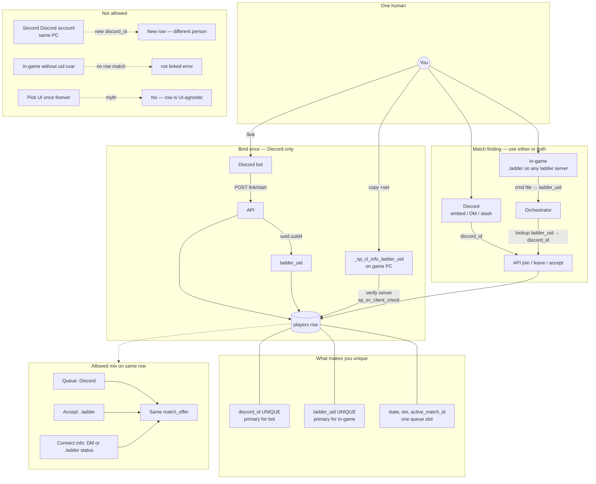

| Question | Answer |
|----------|--------|
| How are players unique? | One `players` row: **`discord_id`** (who you are on Discord) + **`ladder_uid`** (secret UUID on your game client). |
| Can I use both Discord and in-game? | **Yes**, interchangeably after `/link` + verify. |
| Must I keep using the UI I started with? | **No.** State lives in the DB row, not in Discord vs game. |
| What must stay constant? | Same Discord account for `/link`; same **`_sp_cl_info_ladder_uid`** in your shortcut for in-game commands. |
| What is not unique? | In-game **nickname** — never used for identity. |

### How `sp_sv_client_check` works

1. Server calls `sp_sv_client_check SLOT CHALLENGE CVAR` (8-char challenge, cvar name).
2. The **client** reads that cvar locally and responds.
3. SoFplus invokes the global **`.check(~slot, ~challenge, ~cvar, ~value)`** handler on the server.
4. [`ladder_check.func`](game/sofplus/addons/ladder_check.func) accumulates uid/verify values per slot, then **`sp_sc_cvar_save`** writes a small cfg file under `user/sofplus/data/ladder_out/`.
5. The orchestrator parses those files — **no rcon `dumpuser`** on the identity path.

Only cvars with allowed prefixes can be checked, including: `cl_`, `ghl_`, `gl_`, `r_`, `scr_`, `vid_`, and **`_sp_cl_info_`**. We store ladder secrets under `_sp_cl_info_*` so they are readable via this API.

### Where `_sp_cl_info_ladder_uid` gets its value

**`_sp_cl_info_ladder_uid` is only the client cvar name** (SoFplus requires the `_sp_cl_info_` prefix). The **value** inside the quotes is the ladder’s internal id **`players.ladder_uid`** in the database — the same UUID string everywhere.

**You do not invent or choose this UUID.** The ladder API generates it when you run `/link`; you copy it from the Discord message into your game shortcut.

| What | Detail |
|------|--------|
| **Generated by** | FastAPI → [`ladder/identity.start_link()`](ladder/identity.py) |
| **When** | Each `POST /players/link/start` (bot calls this on `/link` with your `discord_id`) |
| **Algorithm** | Python standard library: `uid = str(uuid.uuid4())` (random UUID v4, e.g. `0875472d-7c4e-4fee-acf2-519308e1d441`) |
| **Stored as** | `players.ladder_uid` (unique index; one uid per ladder account) |
| **Sent to you as** | `launch_cvars` in the API response → bot embed field **Launch cvars**: `+set _sp_cl_info_ladder_uid "<uid>" ...` |
| **Your job** | Paste that exact `+set` line into SoF; the client holds the value until the server reads it with `sp_sv_client_check` |

The companion verify secret is generated in the same request with a different function: `verify_nonce = secrets.token_hex(16)` (32 hex chars, not a UUID). That maps to client cvar `_sp_cl_info_ladder_verify` and column `players.verify_nonce`.

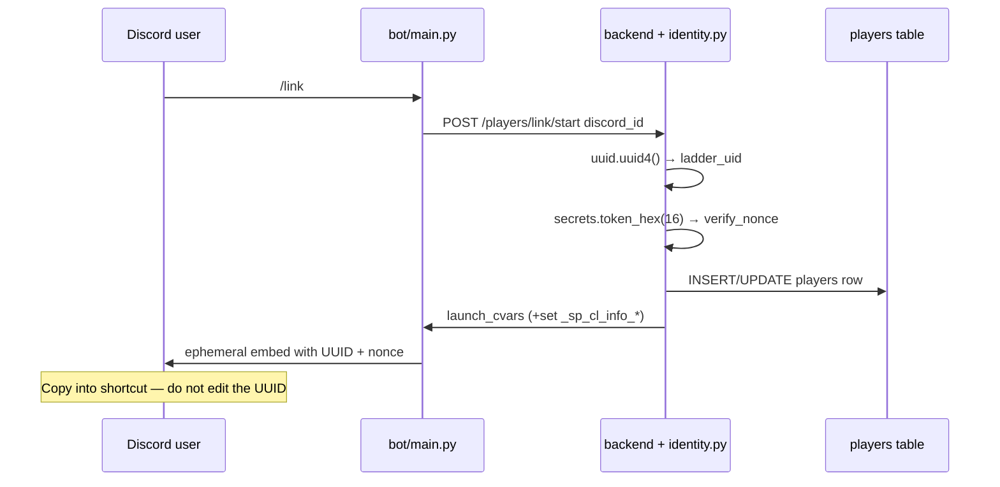

**Re-running `/link`** calls `start_link()` again: a **new** `ladder_uid` and `verify_nonce` replace the old row (and `linked_at` / `sof_name` are cleared until you verify again). Treat the DM UUID as secret credentials for your account.

**After verify**, the UUID in the DB is unchanged; only `verify_nonce` is cleared. Keep using the **same** `_sp_cl_info_ladder_uid` value in your shortcut for all future matches.

### Client cvars (player sets in shortcut / `autoexec.cfg`)

| Client cvar | Value source | Purpose |
|-------------|--------------|---------|
| `_sp_cl_info_ladder_uid` | **`players.ladder_uid`** from API (`uuid.uuid4()` on `/link`) | Permanent account id — queue, pairing, presence |
| `_sp_cl_info_ladder_verify` | **`players.verify_nonce`** from API (`secrets.token_hex(16)` on `/link`) | One-time proof during link only; cleared in DB after confirm |

Example launch line from `/link` DM:

```text
+set _sp_cl_info_ladder_uid "0875472d-7c4e-4fee-acf2-519308e1d441" +set _sp_cl_info_ladder_verify "a4319f98dab49dce35dfc87bb644d835"
```

No Quake **`u` userinfo** flag is required — these are normal client cvars queried by the server.

**After verification**, remove the verify cvar from your shortcut and keep only:

```text
+set _sp_cl_info_ladder_uid "<your-uuid-from-dm>"
```

### Verify server vs match servers

| Server | Port | Spawned when | Identity behavior |
|--------|------|--------------|-------------------|
| **Verify** | `VERIFY_SERVER_PORT` (default `28908`) | Orchestrator sees pending `/link` rows | Reads **uid + verify** → `ladder_out/verify/ev_<nonce>.cfg` |
| **Match** | `PORT_START` … `PORT_END` | Active ranked match | Reads **uid only** → `ladder_out/presence/<uid>.cfg` for dodge/forfeit detection |

Both load `ladder_report.cfg` → `ladder_check.func` + `ladder_match.func`. Install with [`scripts/install-game-configs.sh`](scripts/install-game-configs.sh).

### Link verification (step by step)

1. Run **`/link`** in Discord (ephemeral embed with launch cvars).
2. API runs `start_link()`: generates **`ladder_uid`** (`uuid.uuid4()`) + **`verify_nonce`** (`secrets.token_hex(16)`), stores both on your `players` row (15 min TTL on verify).
3. Add both `+set` lines to your SoF shortcut or `autoexec.cfg`.
4. Connect to **`SERVER_CONNECT_IP:VERIFY_SERVER_PORT`** while the window is open.
5. On join, `ladder_check` probes the slot (and retries on a timer) with `sp_sv_client_check`.
6. When both cvars are read, SoFplus writes `ladder_out/verify/ev_<nonce>.cfg` (includes slot, uid, nonce, `_sp_sv_info_client_name`, IP).
7. Orchestrator [`poll_verify_exports`](orchestrator/verify.py) calls [`try_confirm_from_check`](ladder/identity.py) → sets `sof_name`, `linked_at`, clears `verify_nonce`.
8. **`/stats`** shows your linked name; you may queue.

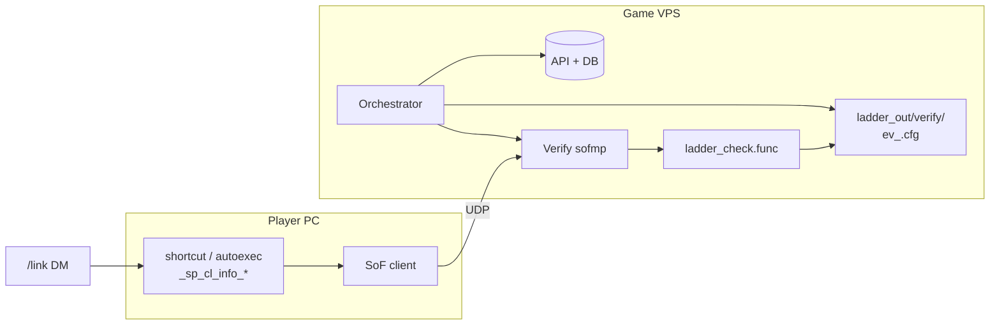

### Database fields

| Column | Meaning |
|--------|---------|
| `ladder_uid` | Server-generated UUID v4 (`uuid.uuid4()` in `start_link`); copied to client as `_sp_cl_info_ladder_uid` |
| `verify_nonce` | Server-generated hex (`secrets.token_hex(16)`); copied to client as `_sp_cl_info_ladder_verify`; `NULL` after confirmed |
| `verify_expires` | UTC expiry for pending link |
| `sof_name` | In-game name captured at verify (display only) |
| `linked_at` | When verify succeeded |

Queue join ([`ladder/identity.is_verified`](ladder/identity.py)): `ladder_uid` present **and** `verify_nonce` is `NULL`.

### Export files (under `SOF_LADDER_OUT_DIR`)

| Path | Written when | Consumed by |
|------|--------------|-------------|
| `verify/ev_<nonce>.cfg` | Verify server; uid **and** verify nonce read | [`poll_verify_exports`](orchestrator/verify.py) |
| `presence/<ladder_uid>.cfg` | Any server; uid read (verify cvar empty) | [`monitor._uids_from_check_exports`](orchestrator/monitor.py) |
| `<match_id>/tmp_player_*.cfg` | Match server snapshots | Frags, names, dodge timing |
| `<match_id>/result.cfg` | Map end | Winner / Elo |

### Security properties

- **Active read** — server requests cvar values from the client; not spoofable by choosing someone else's nickname alone.
- **Server-assigned uid** — `ladder_uid` is created only by the API (`uuid.uuid4()`), not derived from Discord id, IP, or in-game name; players must copy the DM value into `_sp_cl_info_ladder_uid`.
- **One-time nonce** — ties the Discord session to a single client config; expires in ~15 minutes.
- **SoFplus-native** — no dependency on rcon `dumpuser` parsing for identity.
- **Match pairing** — orchestrator matches connected `ladder_uid` values to the two players provisioned for the match (presence + snapshots), not display names alone.

### In-game commands (detail)

SoFplus [`.COMMAND`](https://sof1.megalag.org/sofplus/download/sofplus-manual.html) — functions named `.something` callable from client console/chat. [`ladder_cmd.func`](game/sofplus/addons/ladder_cmd.func) loads on verify, match, and optional hub servers via `ladder_report.cfg`.

| Command | Discord equivalent |
|---------|-------------------|
| `.ladder` | — (help) |
| `.ladder join` | **Find 1v1** |
| `.ladder leave` | **Leave queue** |
| `.ladder status` | `/stats` (+ connect line when match is up) |
| `.ladder accept` | DM accept / `/accept` |

Requires `_sp_cl_info_ladder_uid` in your shortcut; account must already exist via `/link` + verify server.

### Discord commands (detail)

| Command / UI | In-game equivalent |
|--------------|-------------------|
| `/link` | — (required once) |
| Embed **Find 1v1** / **Leave queue** | `.ladder join` / `.ladder leave` |
| `/stats`, embed **Stats** | `.ladder status` |
| `/accept <match_id>`, DM accept button | `.ladder accept` |
| `/leaderboard`, `/cancel` | Discord only |
| Match-offer / connect **DMs** | Optional if you use `.ladder status` |

## VPS / Wine server setup

Run these on the **game VPS** (orchestrator + SoF must live here). API/bot can be on the same box for v1 — see [Deployment topology](#deployment-topology).

1. Install: `wine`, `winetricks`, `xvfb`, Python 3.11+
2. Set **`SOF_INSTALL_DIR`** in `.env` to your SoF root (exe, `user/`, `wineprefix/`, etc.). Derived paths:

   | Variable | Default when unset |
   |----------|-------------------|
   | `SOF_EXE` | `$SOF_INSTALL_DIR/sofmp.exe` |
   | `SOF_CWD` | `$SOF_INSTALL_DIR` |
   | `SOF_USER_SUBFOLDER` | `user` — passed to `+set user`; data at `$SOF_CWD/<subfolder>/` |
   | `SOF_USER_DIR` | `$SOF_CWD/$SOF_USER_SUBFOLDER` |
   | `SOF_DEATHMATCH` | `4` (CTF) on server launch |
   | `WINEPREFIX` | `$SOF_INSTALL_DIR/wineprefix` |
   | `SOF_LADDER_OUT_DIR` | `$SOF_USER_DIR/sofplus/data/ladder_out` |
   | `SOF_LADDER_LOG_DIR` | `/var/log/sof-ladder` |

   Check resolved paths: `PYTHONPATH=. python -m ladder.sof_paths`

3. Install SoF 1.07f + SoFplus into that tree, then ladder scripts ([`info_client.func`](https://github.com/VirtualFj8/sof-discord-bot/blob/main/sofplus/addons/info_client.func) pattern):
   ```bash
   ./scripts/install-game-configs.sh
   ```
   Uses `SOF_INSTALL_DIR` and `SOF_USER_SUBFOLDER` from `.env`. Copies `ladder_match.cfg` to the user folder and `game/sofplus/addons/*` to `$USER_DIR/sofplus/addons/` (same layout as [sof-discord-bot `info_client.func`](https://github.com/VirtualFj8/sof-discord-bot/blob/main/sofplus/addons/info_client.func)).

   Server launch (orchestrator): `+set user <SOF_USER_SUBFOLDER>` `+set dedicated 1` `+set deathmatch 4` then map/cfg exec.
5. Open UDP `VERIFY_SERVER_PORT` (default `28908`), `PORT_START`–`PORT_END` (match servers), and optionally `LADDER_HUB_PORT` if `LADDER_HUB_ENABLED=1`
6. Set `SERVER_CONNECT_IP` to your public IP

## Match data (SoFplus exports)

The orchestrator reads text files the server writes under `user/sofplus/data/ladder_out/` via [`sp_sc_cvar_save`](https://sof1.megalag.org/sofplus/download/sofplus-manual.html) (same pattern as community **info_client**).

| File (under `ladder_out/<match_id>/`) | Written when | Used for |
|---------------------------------------|--------------|----------|
| `presence/<ladder_uid>.cfg` | Match/verify join (`ladder_check`) | Which provisioned uids are connected |
| `tmp_player_<slot>.cfg` | Every ~5s + on connect (`ladder_snapshot`) | Live frags, names, dodge timing |
| `player_<slot>.cfg` | Map end | Final per-player `_sp_sv_info_client_*` dump |
| `result.cfg` | Map end (`ladder_match_map_end`) | `ladder_ready`, `ladder_winner_name`, `ladder_end_reason`, `fraglimit` / `timelimit` logic |

Server launch sets `+set ladder_matchid <id>` so exports land in the correct folder. Match logic: [`game/sofplus/addons/ladder_match.func`](game/sofplus/addons/ladder_match.func). Identity probes: [`ladder_check.func`](game/sofplus/addons/ladder_check.func) (shared with verify server).

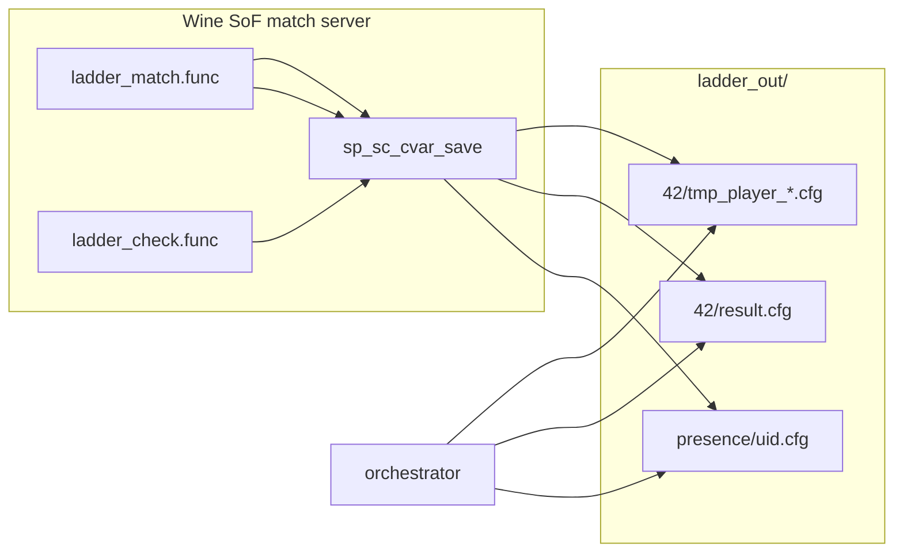

## systemd (production)

Install all three units on **one host** unless you are deliberately splitting bot/API onto another machine (orchestrator **always** stays on the game VPS).

```bash
sudo cp -r . /opt/sof-ladder
sudo cp deploy/*.service /etc/systemd/system/
sudo systemctl enable --now sof-ladder-api sof-ladder-bot sof-ladder-orchestrator
```

## Elo & anti-abuse

- Standard Elo with variable K by games played (see `ladder/elo.py`)
- Queue spam, accept timeout, dodge, forfeit, and strikes (see `ladder/penalties.py`)

## API secrets

- Bot uses `Authorization: Bearer $BOT_API_SECRET`
- Orchestrator uses header `X-Orchestrator-Secret: $ORCHESTRATOR_SECRET`
