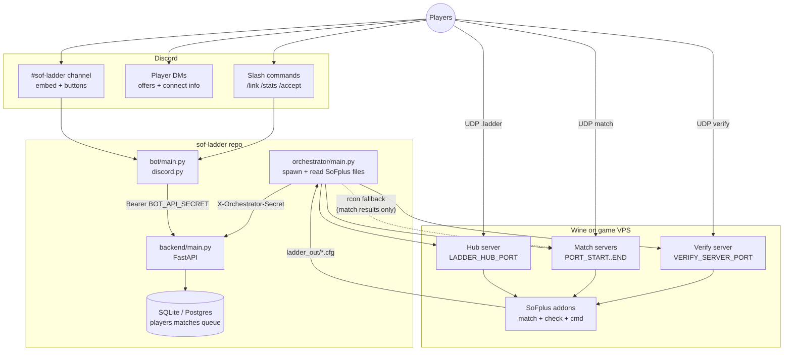
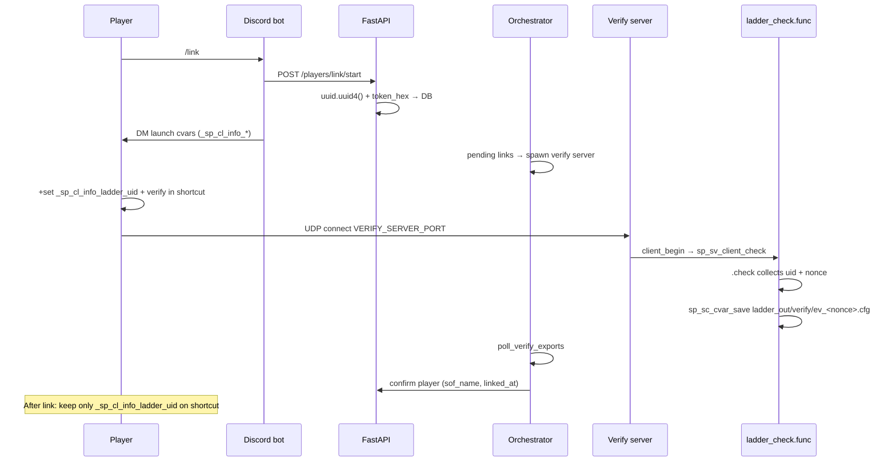
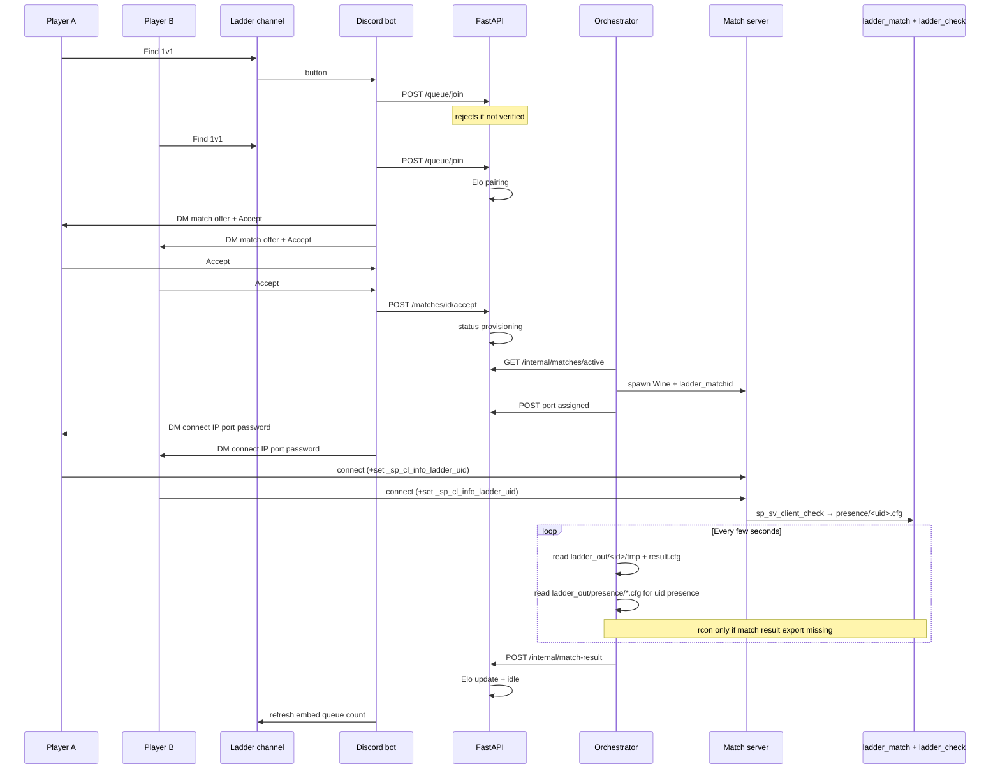
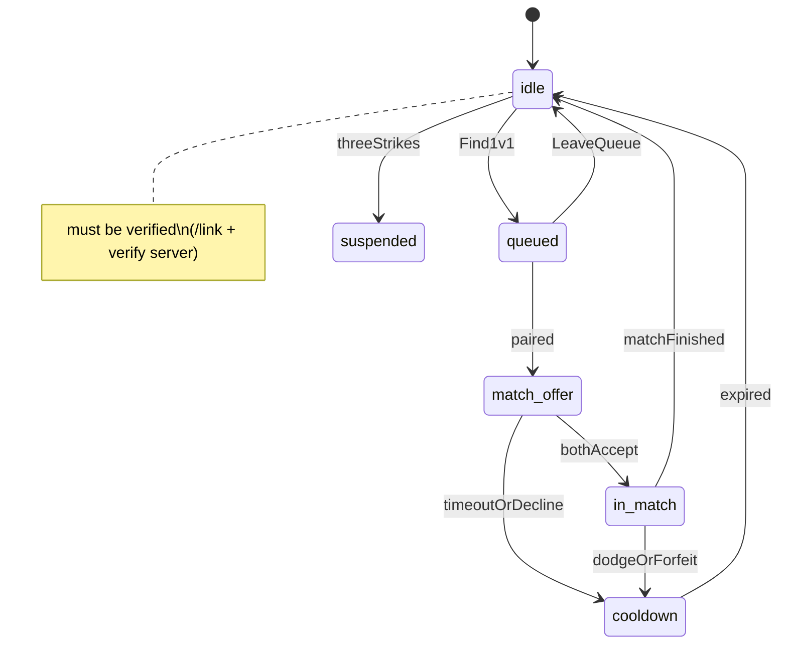
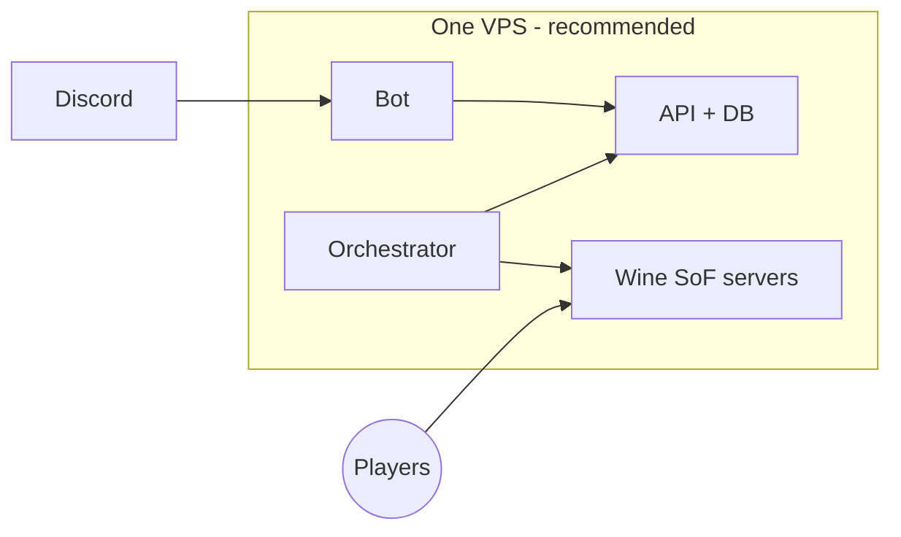
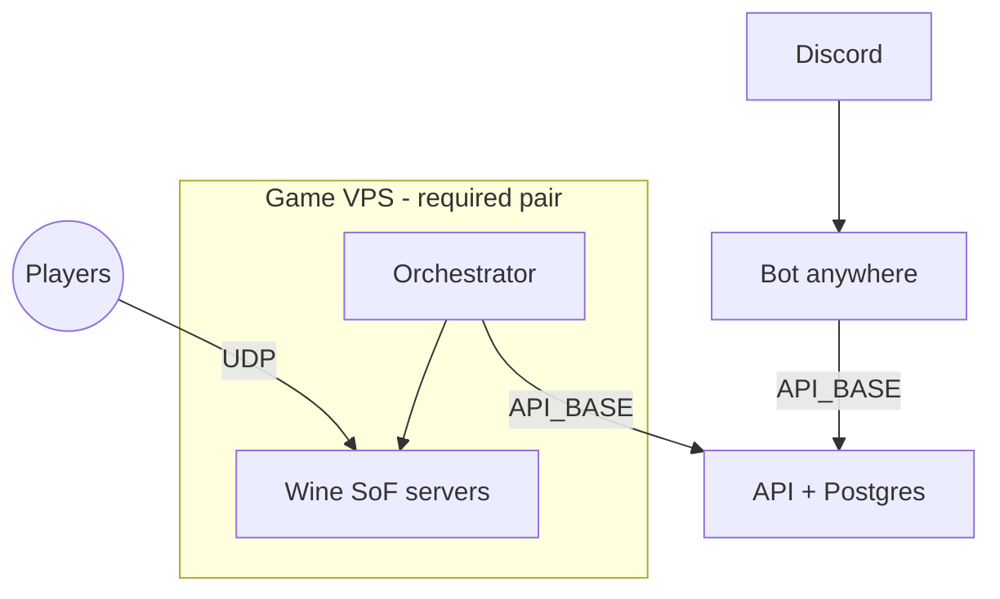
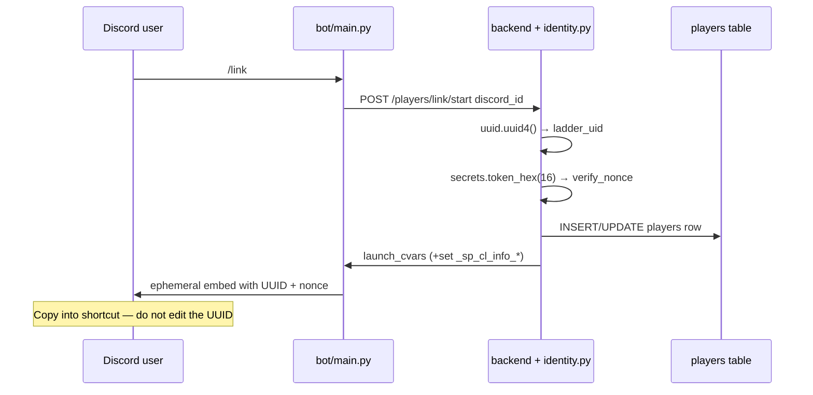
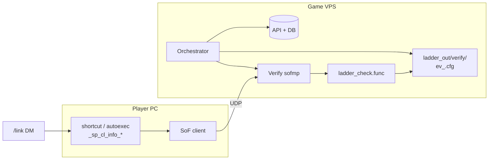
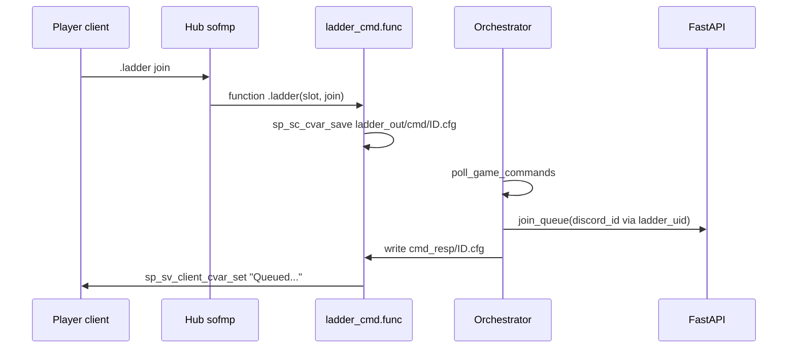
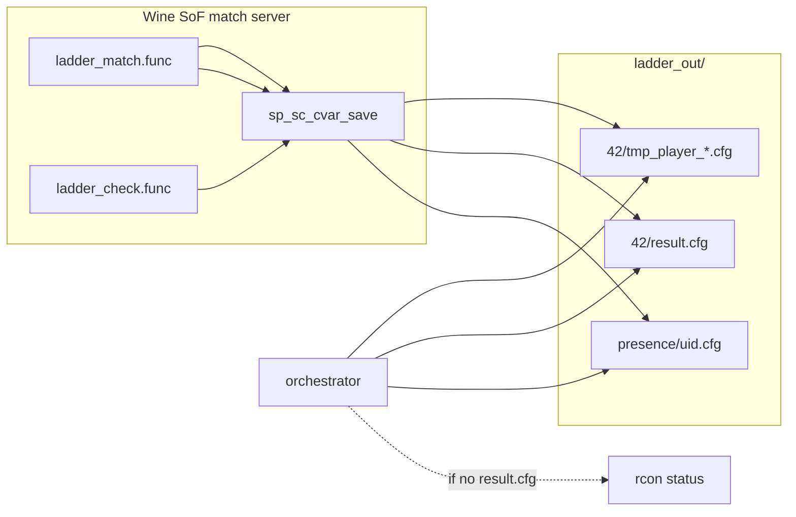

# SoF Ladder — 1v1 Discord Matchmaking

Discord-driven ranked 1v1 deathmatch ladder for Soldier of Fortune. Players queue in a dedicated channel, get paired by Elo, accept matches, and connect to dynamically spawned Wine dedicated servers.

## System architecture

Default **v1 layout: everything on one game VPS** (simplest). Components can be split in some cases — see [Deployment topology](#deployment-topology).



### Player link flow (`/link`)

Verification is **required before queueing**. Identity uses SoFplus [`sp_sv_client_check`](https://sof1.megalag.org/sofplus/download/sofplus-manual.html) — not rcon `dumpuser` or userinfo.



### Match flow (1v1)

From queue to Elo update (both players must already be **verified** — `ladder_uid` set, `verify_nonce` cleared):



### Player states (API)



## Components

| Service | Module | Role |
|---------|--------|------|
| API | `backend/main.py` | Players, queue, Elo, matches |
| Bot | `bot/main.py` | Discord slash commands and ladder channel UI |
| Orchestrator | `orchestrator/main.py` | Spawn Wine servers; **read SoFplus export files**; rcon fallback |
| Game configs | `game/` | `ladder_match.cfg`, `sofplus/addons/*.func` |

## Deployment topology

Where each process must run, and what can be remote.

### What each process is (four separate programs)

These are **not** one monolith — you start up to **four Python processes** (plus Wine game servers when matches run):

| What you run | Code | What it does |
|--------------|------|----------------|
| **API server** | `uvicorn backend.main:app` → [`backend/main.py`](backend/main.py) | HTTP REST API: players, Elo, queue, matches, DB reads/writes. **No Discord, no Wine.** |
| **Discord bot** | `python -m bot.main` → [`bot/main.py`](bot/main.py) | Long-lived **discord.py** client: slash commands (`/link`, `/stats`), ladder channel **embed + buttons**, DMs for match accept/connect. Calls the API over HTTP — it does **not** implement ladder rules itself. |
| **Orchestrator** | `python -m orchestrator.main` → [`orchestrator/main.py`](orchestrator/main.py) | Polls API, **spawns/kills** `wine sofmp.exe`, watches **`user/sofplus/data/ladder_out/<match_id>/`** written by SoFplus ([`sp_sc_cvar_save`](https://sof1.megalag.org/sofplus/download/sofplus-manual.html)). Uses **rcon only as fallback**. **No Discord.** |
| **SoF dedicated server** | `wine … sofmp.exe` (child of orchestrator) | Actual game sim players connect to over **UDP**. Not Python; one process per active match. |

The row people confuse is the **Discord bot** (`bot/main.py`): it is only the Discord-facing UI layer. Players never “connect to the bot” for gameplay — they talk to Discord; the bot talks to your API; the API talks to the DB; the orchestrator runs the game.

### Co-location rules

| Component | Must co-locate with | Can run on another machine? | Why |
|-----------|---------------------|-----------------------------|-----|
| **Wine SoF dedicated server** (`sofmp.exe`) | **Orchestrator** | **No** | Spawned locally; SoFplus writes `ladder_out/<match_id>/*.cfg` beside the server; orchestrator reads those paths (rcon optional fallback). |
| **Orchestrator** (`orchestrator/main.py`) | **SoF server processes** | **No** (v1) | Reads `SOF_INSTALL_DIR` (and overrides) from `.env`; spawns `SOF_EXE` under that tree. |
| **API + database** (`backend/main.py` + DB file/Postgres) | Each other | Orchestrator/bot can point at a **remote** `API_BASE` | Default SQLite file must sit beside the API process; use Postgres if API is remote. |
| **Discord bot** (`python -m bot.main`) | **Nothing** (no hard coupling) | **Yes** | Needs only: outbound HTTPS to `API_BASE` (your FastAPI URL) and outbound access to **Discord’s servers**. Does not need Wine, SoF assets, open game ports, or rcon. Typical split: bot on a small always-on box, API + orchestrator + game on the VPS. |

**Discord bot detail** — if you run `python -m bot.main` on your laptop and `API_BASE=http://your-vps:8080` on the VPS:

- Slash commands and the `#sof-ladder` embed work as long as the API is reachable and `DISCORD_BOT_TOKEN` / channel IDs are set.
- Matchmaking, Elo, and match state still live on the VPS API/DB.
- Game servers still spawn only on the machine running **orchestrator**; connect DMs use `SERVER_CONNECT_IP` from `.env` (the game host’s public IP), not the bot’s IP.

### Recommended (v1): single game VPS

All four processes on the machine that runs Wine/SoF. This matches the systemd units in `deploy/` and the diagrams above.



Set `SERVER_CONNECT_IP` to this VPS **public IP** so connect DMs point players at the right host.

### Optional split layout

Only split if you accept extra setup (Postgres, firewall rules, TLS on API).



| Host | Run here | `.env` notes |
|------|----------|----------------|
| **Game VPS** | `orchestrator` + Wine/SoF | `API_BASE=https://your-api.example` (reachable URL), `SERVER_CONNECT_IP=<game VPS public IP>`, local `SOF_*` / `WINE*` paths |
| **App host** | `backend` (API) + DB | `DATABASE_URL=postgres://...`, bind `0.0.0.0` or reverse proxy; open port to bot + orchestrator only |
| **Any** (laptop, RPi, second VPS) | `python -m bot.main` | `API_BASE` → app host URL; `DISCORD_BOT_TOKEN`, `DISCORD_GUILD_ID`, `DISCORD_LADDER_CHANNEL_ID`; same `BOT_API_SECRET` as API expects |

**Do not** run the orchestrator on a different machine than the SoF servers without code changes (remote spawn/rcon are not implemented).

**Bot (`bot/main.py`) and API (`backend/main.py`)** on separate machines is fine: set the bot’s `API_BASE` to the API’s URL and use the same `BOT_API_SECRET` in both `.env` files. The bot never touches the database directly.

### Quick reference

```
┌─────────────────────────────────────────────────────────┐
│  SAME MACHINE (required)                                 │
│    orchestrator/main.py  ←→  wine sofmp.exe (match + verify) │
│    ladder_out/ — verify/, presence/, <match_id>/            │
└─────────────────────────────────────────────────────────┘

┌─────────────────────────────────────────────────────────┐
│  SAME MACHINE (recommended v1)                           │
│    backend/main.py  ←→  sqlite file or postgres          │
└─────────────────────────────────────────────────────────┘

┌─────────────────────────────────────────────────────────┐
│  ANY HOST with internet (optional split)                 │
│    python -m bot.main  ──HTTPS──►  API_BASE              │
│    (discord.py ↔ Discord; no game/Wine/rcon)             │
└─────────────────────────────────────────────────────────┘
```

## Quick start (dev)

```bash
cd sof-ladder
python3 -m venv venv
./venv/bin/pip install -r requirements.txt
cp .env.example .env
# Edit .env: BOT_API_SECRET, ORCHESTRATOR_SECRET, DISCORD_*, SOF_INSTALL_DIR, ...

chmod +x scripts/*.sh scripts/lib/common.sh
./scripts/run-all.sh          # API → bot → orchestrator (background)
./scripts/status.sh           # PIDs + API health + SoF paths
./scripts/stop-all.sh         # stop everything
```

Logs live under `.run/logs/` (`api.log`, `bot.log`, `orchestrator.log`).

**Foreground** (separate terminals, API with reload):

```bash
./scripts/run-api.sh --fg
./scripts/run-bot.sh --fg
./scripts/run-orchestrator.sh --fg
```

| Script | Role |
|--------|------|
| [`scripts/run-all.sh`](scripts/run-all.sh) | Start all services in order |
| [`scripts/stop-all.sh`](scripts/stop-all.sh) | Stop by PID files |
| [`scripts/status.sh`](scripts/status.sh) | PIDs, `/health`, `ladder.sof_paths` |
| [`scripts/run-api.sh`](scripts/run-api.sh) | API only |
| [`scripts/run-bot.sh`](scripts/run-bot.sh) | Discord bot only |
| [`scripts/run-orchestrator.sh`](scripts/run-orchestrator.sh) | Game orchestrator only |
| [`scripts/install-game-configs.sh`](scripts/install-game-configs.sh) | Copy cfg/func into SoF user dir |

## Discord setup

1. Create an application at https://discord.com/developers/applications
2. Add a bot and copy the token into `DISCORD_BOT_TOKEN`
3. **Invite the bot to your server** with scopes **`bot`** and **`applications.commands`** (required for slash commands). On startup the bot prints an invite URL, or use:
   `https://discord.com/oauth2/authorize?client_id=YOUR_APP_ID&permissions=2147486720&scope=bot%20applications.commands`
4. Set `DISCORD_GUILD_ID` to your server ID (Developer Mode → right-click server → Copy Server ID)
5. The bot must be a member of that guild before guild command sync works; otherwise it falls back to global sync

### Ladder channel embed (setup & sync)

The ladder UI is a **single persistent message** in one text channel — not a new post every time someone queues.

#### One-time channel setup

1. Create a dedicated text channel (e.g. `#sof-ladder`).
2. Enable **Developer Mode** in Discord → User Settings → Advanced → right-click the channel → **Copy Channel ID**.
3. Put that ID in `.env` as `DISCORD_LADDER_CHANNEL_ID`.
4. Ensure the bot role can **View Channel**, **Send Messages**, **Embed Links**, and **Read Message History** in that channel.
5. Start the API (`uvicorn backend.main:app`) and the bot (`python -m bot.main`). No manual message is required.

#### What the bot does on startup

When the bot connects (`on_ready` in `bot/main.py`):

1. Registers **persistent button handlers** (`LadderView` with fixed `custom_id`s) so **Find 1v1** / **Leave queue** / **Stats** keep working after a bot restart.
2. Syncs slash commands (guild or global — see above).
3. Calls `refresh_ladder_embed()` for `DISCORD_LADDER_CHANNEL_ID`.

#### How `refresh_ladder_embed` works

Implementation: `bot/main.py` → `refresh_ladder_embed()`.

| Step | Behavior |
|------|----------|
| Find existing panel | Reads the last **10** messages in the ladder channel. |
| Reuse if found | If one is from **this bot** and has an **embed**, that message is **edited** in place (same message ID, no spam). |
| Create if missing | If none found, the bot **sends** a new embed message. |

**Embed content** (updated on each refresh):

- Title: **SoF 1v1 Ladder**
- Description: reminder to `/link` first
- **In queue** — live count from `GET /queue/count` on the API
- **Map** — `dm/jpntclx` (v1 default)
- **Frag limit** — from `FRAGLIMIT` in `.env`

**Buttons** on the same message:

| Button | Action |
|--------|--------|
| **Find 1v1** | `POST /queue/join` — ephemeral reply to the clicker; refreshes the channel embed |
| **Leave queue** | `POST /queue/leave` — ephemeral reply; refreshes the embed |
| **Stats** | `GET /players/{discord_id}` — ephemeral only (does not edit the panel) |

The embed’s **In queue** count is refreshed when someone uses **Find 1v1**, **Leave queue**, or `/cancel`, and when the bot starts. It is not polled on a timer; two players queuing without touching the panel may leave the count slightly stale until the next refresh.

#### After setup you should see

- One red embed in `#sof-ladder` with three buttons.
- Clicking **Stats** without `/link` still works but shows `not linked`.
- Queueing requires **`/link`** and verify-server confirmation first (ephemeral errors come from the API).

#### Troubleshooting the panel

| Problem | Fix |
|---------|-----|
| No embed appears | Check `DISCORD_LADDER_CHANNEL_ID`, bot permissions, and that the API is running (queue count call fails silently if the channel is wrong). |
| Multiple embeds | Delete older bot messages in the channel; restart the bot — it will adopt the newest qualifying message in the last 10 or post a new one. |
| Buttons do nothing after restart | Restart the bot once so `on_ready` runs `bot.add_view(LadderView())` (persistent views). |
| Wrong queue count | Use **Leave queue** / **Find 1v1** or restart the bot to force `refresh_ladder_embed`. |

Match offers and connect info are **not** on this embed — they are sent by **DM** (and the background poll for pending/live matches). Players must allow DMs from server members or use `/accept <match_id>`.

## Player identity

Discord display names and in-game nicknames are **not** trusted for account binding or match pairing. On `/link`, the API generates a server-side **`ladder_uid`** (`uuid.uuid4()`, stored in the DB) and tells you to copy it into client cvar **`_sp_cl_info_ladder_uid`**; SoFplus **`sp_sv_client_check`** then proves your game client actually holds that value. — the same mechanism documented in the [SoFplus manual](https://sof1.megalag.org/sofplus/download/sofplus-manual.html) and used by community bots ([`info_client.func`](https://github.com/VirtualFj8/sof-discord-bot/blob/main/sofplus/addons/info_client.func)).

### How `sp_sv_client_check` works

1. Server calls `sp_sv_client_check SLOT CHALLENGE CVAR` (8-char challenge, cvar name).
2. The **client** reads that cvar locally and responds.
3. SoFplus invokes the global **`.check(~slot, ~challenge, ~cvar, ~value)`** handler on the server.
4. [`ladder_check.func`](game/sofplus/addons/ladder_check.func) accumulates uid/verify values per slot, then **`sp_sc_cvar_save`** writes a small cfg file under `user/sofplus/data/ladder_out/`.
5. The orchestrator parses those files — **no rcon `dumpuser`** on the identity path.

Only cvars with allowed prefixes can be checked, including: `cl_`, `ghl_`, `gl_`, `r_`, `scr_`, `vid_`, and **`_sp_cl_info_`**. We store ladder secrets under `_sp_cl_info_*` so they are readable via this API.

### Where `_sp_cl_info_ladder_uid` gets its value

**`_sp_cl_info_ladder_uid` is only the client cvar name** (SoFplus requires the `_sp_cl_info_` prefix). The **value** inside the quotes is the ladder’s internal id **`players.ladder_uid`** in the database — the same UUID string everywhere.

**You do not invent or choose this UUID.** The ladder API generates it when you run `/link`; you copy it from the Discord message into your game shortcut.

| What | Detail |
|------|--------|
| **Generated by** | FastAPI → [`ladder/identity.start_link()`](ladder/identity.py) |
| **When** | Each `POST /players/link/start` (bot calls this on `/link` with your `discord_id`) |
| **Algorithm** | Python standard library: `uid = str(uuid.uuid4())` (random UUID v4, e.g. `0875472d-7c4e-4fee-acf2-519308e1d441`) |
| **Stored as** | `players.ladder_uid` (unique index; one uid per ladder account) |
| **Sent to you as** | `launch_cvars` in the API response → bot embed field **Launch cvars**: `+set _sp_cl_info_ladder_uid "<uid>" ...` |
| **Your job** | Paste that exact `+set` line into SoF; the client holds the value until the server reads it with `sp_sv_client_check` |

The companion verify secret is generated in the same request with a different function: `verify_nonce = secrets.token_hex(16)` (32 hex chars, not a UUID). That maps to client cvar `_sp_cl_info_ladder_verify` and column `players.verify_nonce`.



**Re-running `/link`** calls `start_link()` again: a **new** `ladder_uid` and `verify_nonce` replace the old row (and `linked_at` / `sof_name` are cleared until you verify again). Treat the DM UUID as secret credentials for your account.

**After verify**, the UUID in the DB is unchanged; only `verify_nonce` is cleared. Keep using the **same** `_sp_cl_info_ladder_uid` value in your shortcut for all future matches.

### Client cvars (player sets in shortcut / `autoexec.cfg`)

| Client cvar | Value source | Purpose |
|-------------|--------------|---------|
| `_sp_cl_info_ladder_uid` | **`players.ladder_uid`** from API (`uuid.uuid4()` on `/link`) | Permanent account id — queue, pairing, presence |
| `_sp_cl_info_ladder_verify` | **`players.verify_nonce`** from API (`secrets.token_hex(16)` on `/link`) | One-time proof during link only; cleared in DB after confirm |

Example launch line from `/link` DM:

```text
+set _sp_cl_info_ladder_uid "0875472d-7c4e-4fee-acf2-519308e1d441" +set _sp_cl_info_ladder_verify "a4319f98dab49dce35dfc87bb644d835"
```

No Quake **`u` userinfo** flag is required — these are normal client cvars queried by the server.

**After verification**, remove the verify cvar from your shortcut and keep only:

```text
+set _sp_cl_info_ladder_uid "<your-uuid-from-dm>"
```

### Verify server vs match servers

| Server | Port | Spawned when | Identity behavior |
|--------|------|--------------|-------------------|
| **Verify** | `VERIFY_SERVER_PORT` (default `28908`) | Orchestrator sees pending `/link` rows | Reads **uid + verify** → `ladder_out/verify/ev_<nonce>.cfg` |
| **Match** | `PORT_START` … `PORT_END` | Active ranked match | Reads **uid only** → `ladder_out/presence/<uid>.cfg` for dodge/forfeit detection |

Both load `ladder_report.cfg` → `ladder_check.func` + `ladder_match.func`. Install with [`scripts/install-game-configs.sh`](scripts/install-game-configs.sh).

### Link verification (step by step)

1. Run **`/link`** in Discord (ephemeral embed with launch cvars).
2. API runs `start_link()`: generates **`ladder_uid`** (`uuid.uuid4()`) + **`verify_nonce`** (`secrets.token_hex(16)`), stores both on your `players` row (15 min TTL on verify).
3. Add both `+set` lines to your SoF shortcut or `autoexec.cfg`.
4. Connect to **`SERVER_CONNECT_IP:VERIFY_SERVER_PORT`** while the window is open.
5. On join, `ladder_check` probes the slot (and retries on a timer) with `sp_sv_client_check`.
6. When both cvars are read, SoFplus writes `ladder_out/verify/ev_<nonce>.cfg` (includes slot, uid, nonce, `_sp_sv_info_client_name`, IP).
7. Orchestrator [`poll_verify_exports`](orchestrator/verify.py) calls [`try_confirm_from_check`](ladder/identity.py) → sets `sof_name`, `linked_at`, clears `verify_nonce`.
8. **`/stats`** shows your linked name; you may queue.



### Database fields

| Column | Meaning |
|--------|---------|
| `ladder_uid` | Server-generated UUID v4 (`uuid.uuid4()` in `start_link`); copied to client as `_sp_cl_info_ladder_uid` |
| `verify_nonce` | Server-generated hex (`secrets.token_hex(16)`); copied to client as `_sp_cl_info_ladder_verify`; `NULL` after confirmed |
| `verify_expires` | UTC expiry for pending link |
| `sof_name` | In-game name captured at verify (display only) |
| `linked_at` | When verify succeeded |

Queue join ([`ladder/identity.is_verified`](ladder/identity.py)): `ladder_uid` present **and** `verify_nonce` is `NULL`.

### Export files (under `SOF_LADDER_OUT_DIR`)

| Path | Written when | Consumed by |
|------|--------------|-------------|
| `verify/ev_<nonce>.cfg` | Verify server; uid **and** verify nonce read | [`poll_verify_exports`](orchestrator/verify.py) |
| `presence/<ladder_uid>.cfg` | Any server; uid read (verify cvar empty) | [`monitor._uids_from_check_exports`](orchestrator/monitor.py) |
| `<match_id>/tmp_player_*.cfg` | Match server snapshots | Frags, names, dodge timing |
| `<match_id>/result.cfg` | Map end | Winner / Elo |

### Persistence (same uid after reboot)

Identity is split between **two places**:

| Where | What is stored | Survives PC reboot? |
|-------|----------------|---------------------|
| **Ladder DB** (`players.ladder_uid`) | Your account UUID, tied to Discord | **Yes** — permanent until you run `/link` again |
| **Your PC** (SoF shortcut / `autoexec.cfg`) | `+set _sp_cl_info_ladder_uid "<uuid>"` | **Only if you save it there** — the game does not remember it for you |

The ladder **does not** push cvars to your machine after verify. You must **persist the launch line yourself**, the same way you would any other `+set` options:

- SoF **desktop shortcut** target / “Properties → Target” extra arguments  
- `autoexec.cfg` (or a cfg you `exec` from it) under your SoF user folder  
- A small launcher script you always use to start the game  

After a reboot or reinstall, connect with the **same** `+set _sp_cl_info_ladder_uid "…"` line — the value must still match `players.ladder_uid` in the database.

**Recovering a lost client config (without re-linking):**

- Use the channel **Stats** button or `/stats` — both show your `ladder_uid` if you are already verified. Copy it back into your shortcut.
- **Do not run `/link` again** just to “get the uuid back” — that **rotates** `ladder_uid` in the DB and invalidates your old shortcut until you verify the new pair.

**Re-running `/link`** is only for intentionally re-binding or if you never finished verify; it issues a **new** UUID and nonce.

### Security properties

- **Active read** — server requests cvar values from the client; not spoofable by choosing someone else's nickname alone.
- **Server-assigned uid** — `ladder_uid` is created only by the API (`uuid.uuid4()`), not derived from Discord id, IP, or in-game name; players must copy the DM value into `_sp_cl_info_ladder_uid`.
- **One-time nonce** — ties the Discord session to a single client config; expires in ~15 minutes.
- **SoFplus-native** — no dependency on rcon `dumpuser` parsing for identity.
- **Match pairing** — orchestrator matches connected `ladder_uid` values to the two players provisioned for the match (presence + snapshots), not display names alone.

### In-game commands (SoFplus `.COMMAND`)

Verified players can queue and accept matches **from inside SoF** without opening Discord. The orchestrator runs an always-on **hub server** (`LADDER_HUB_PORT`, default `28907`) that loads [`ladder_cmd.func`](game/sofplus/addons/ladder_cmd.func).

SoFplus lets server admins define client commands as functions whose names start with **`.`** ([manual: `.COMMAND`](https://sof1.megalag.org/sofplus/download/sofplus-manual.html)). Players type in console or chat:

| Command | Action |
|---------|--------|
| `.ladder` | Help |
| `.ladder join` | `POST` equivalent of **Find 1v1** (queue by `ladder_uid`) |
| `.ladder leave` | Leave queue |
| `.ladder status` | Elo, state, pending match, connect `IP:port` when ready |
| `.ladder accept` | Accept pending match offer (both players must accept) |

**Requirements:** `_sp_cl_info_ladder_uid` in your shortcut (same as ranked matches). Discord `/link` + verify is still required once to create the account.

**How it works**



The same `.ladder` handlers also load on **verify** and **match** servers (via `ladder_report.cfg`), but the dedicated hub is the intended place to queue while idle.

Match offers may still arrive by **Discord DM**; use `.ladder accept` in-game or `/accept` on Discord.

### Commands (Discord)

- `/link` — issue uid + verify nonce; DM launch cvars + verify + hub address
- `/stats`, `/leaderboard`, `/cancel`, `/accept <match_id>`

Slash commands and the channel embed are optional once you use the hub; the embed is still useful for queue count at a glance.

## VPS / Wine server setup

Run these on the **game VPS** (orchestrator + SoF must live here). API/bot can be on the same box for v1 — see [Deployment topology](#deployment-topology).

1. Install: `wine`, `winetricks`, `xvfb`, Python 3.11+
2. Set **`SOF_INSTALL_DIR`** in `.env` to your SoF root (exe, `user/`, `wineprefix/`, etc.). Derived paths:

   | Variable | Default when unset |
   |----------|-------------------|
   | `SOF_EXE` | `$SOF_INSTALL_DIR/sofmp.exe` |
   | `SOF_CWD` | `$SOF_INSTALL_DIR` |
   | `SOF_USER_SUBFOLDER` | `user` — passed to `+set user`; data at `$SOF_CWD/<subfolder>/` |
   | `SOF_USER_DIR` | `$SOF_CWD/$SOF_USER_SUBFOLDER` |
   | `SOF_DEATHMATCH` | `4` (CTF) on server launch |
   | `WINEPREFIX` | `$SOF_INSTALL_DIR/wineprefix` |
   | `SOF_LADDER_OUT_DIR` | `$SOF_USER_DIR/sofplus/data/ladder_out` |
   | `SOF_LADDER_LOG_DIR` | `/var/log/sof-ladder` |

   Check resolved paths: `PYTHONPATH=. python -m ladder.sof_paths`

3. Install SoF 1.07f + SoFplus into that tree, then ladder scripts ([`info_client.func`](https://github.com/VirtualFj8/sof-discord-bot/blob/main/sofplus/addons/info_client.func) pattern):
   ```bash
   ./scripts/install-game-configs.sh
   ```
   Uses `SOF_INSTALL_DIR` and `SOF_USER_SUBFOLDER` from `.env`. Copies `ladder_match.cfg` to the user folder and `game/sofplus/addons/*` to `$USER_DIR/sofplus/addons/` (same layout as [sof-discord-bot `info_client.func`](https://github.com/VirtualFj8/sof-discord-bot/blob/main/sofplus/addons/info_client.func)).

   Server launch (orchestrator): `+set user <SOF_USER_SUBFOLDER>` `+set dedicated 1` `+set deathmatch 4` then map/cfg exec.
5. Open UDP ports `LADDER_HUB_PORT` (default `28907`), `VERIFY_SERVER_PORT` (default `28908`), and `PORT_START`–`PORT_END` (match servers)
6. Set `SERVER_CONNECT_IP` to your public IP

## Match data: SoFplus first, rcon fallback

The orchestrator does **not** rely on rcon for normal results. It mirrors the community **info_client** pattern: the server dumps cvars to text files under `user/sofplus/data/` using [`sp_sc_cvar_save`](https://sof1.megalag.org/sofplus/download/sofplus-manual.html).

| File (under `ladder_out/<match_id>/`) | Written when | Used for |
|---------------------------------------|--------------|----------|
| `presence/<ladder_uid>.cfg` | Match/verify join (`ladder_check`) | Which provisioned uids are connected |
| `tmp_player_<slot>.cfg` | Every ~5s + on connect (`ladder_snapshot`) | Live frags, names, dodge timing |
| `player_<slot>.cfg` | Map end | Final per-player `_sp_sv_info_client_*` dump |
| `result.cfg` | Map end (`ladder_match_map_end`) | `ladder_ready`, `ladder_winner_name`, `ladder_end_reason`, `fraglimit` / `timelimit` logic |

Server launch sets `+set ladder_matchid <id>` so exports land in the correct folder. Match logic: [`game/sofplus/addons/ladder_match.func`](game/sofplus/addons/ladder_match.func). Identity probes: [`ladder_check.func`](game/sofplus/addons/ladder_check.func) (shared with verify server).

**Rcon fallback** ([`orchestrator/monitor.py`](orchestrator/monitor.py)): used only if `result.cfg` is not ready and snapshots are empty — e.g. SoFplus script missing, wrong install path, or non-ladder server. Keeps the pathway for future debugging.



## systemd (production)

Install all three units on **one host** unless you are deliberately splitting bot/API onto another machine (orchestrator **always** stays on the game VPS).

```bash
sudo cp -r . /opt/sof-ladder
sudo cp deploy/*.service /etc/systemd/system/
sudo systemctl enable --now sof-ladder-api sof-ladder-bot sof-ladder-orchestrator
```

## Elo & anti-abuse

- Standard Elo with variable K by games played (see `ladder/elo.py`)
- Queue spam, accept timeout, dodge, forfeit, and strikes (see `ladder/penalties.py`)

## API secrets

- Bot uses `Authorization: Bearer $BOT_API_SECRET`
- Orchestrator uses header `X-Orchestrator-Secret: $ORCHESTRATOR_SECRET`
